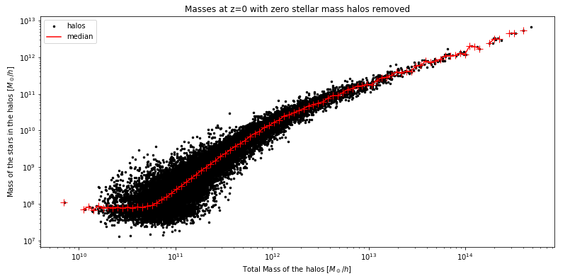
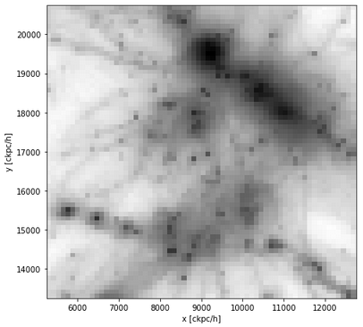

# small_projects
Several projects made in 2018-2019. 

**1_ Semaine Observatoire (OHP)** is the work made with two other students during a week at the _Observatoire de Haute-Provence_"_ (OHP). It contains the data taken, a useful article and the report made "Étude photométrique de l’amas ouvert NGC 1245" (sadly, in French only). The two following pictures show the effect of extinction on the built HR-diagram and the HR-diagram superposed with corresponding isochrone.  

   

  

**8_ Projet Numérique (PN)** is a project made with a scientist from the CRAL. There wasn't any specificly allocated time for this project and was done along the other courses and exams. My project was under the supervision of Jeremy Blaizot and Joakim Rosdhal and consisted in developing a __2D hydrodynamical code__ in __Fortran__ and apply it to the modelling of a supernova. It was successfully done as shown by the two pictures shown. This folder contains the source code for the simulation (_Code_), some useful courses for the project (_Cours_), videos of the simulation (_Vidéos_) and slides (_Présentation.*_) as this was judged by an oral exam.  

  

  

**9_Cours Python** contains the work made for an evaluated project. The instructions were to do something in __Python__ in __1 day__ that could be judged. So I made a __Matrix rain__ with several add-ons. The result at the end of the project is the script Matrix_v1.6.0.py and needs to be launched alongside VarMatrix.py.   
Afterwards I improved it a bit by shifting the logic of the script to make it faster. This corresponds Matrix_v2.0.py (still in dev)s and needs to be launched with VarMatrix2.py.   

**12_Thèses/Anna_Pillepich** corresponds to two small exercises made "to check whether [one] can be a good match for the group and position". They are both done on the same jupyter file.
1. plot the stellar mass - total halo mass relation of galaxies at z=0: scatter plot (one dot one galaxy) + a running median in bins of halo mass.  
2. visualize the stellar mass density in projection of a galaxy from one of the TNG runs. Note that here is shown the gas density and not the stellar mass density as the image is nicer. This is due to the gas density being more sparse.

 

